# Visual pipeline + content engine

Planning doc for how we plug the visual pipeline into Flywheel's actual content engine and make client visuals feel genuinely distinct.

## Where things stand

Right now the pipeline is basically a prototype. It crawls one website, guesses a visual format (accuracy on held-out data is around 42%), renders from a fixed template set, and spits out one image per post.

What we need is a per-client visual layer inside the content engine. It should read the design portfolios we already build for clients, pick formats with some confidence, render 2 or 3 real options per post, and not let anything ship unless it actually looks like that client.

| Now                                    | Where we need to go                                     |
| -------------------------------------- | ------------------------------------------------------- |
| One brand from a crawl                 | Per-client portfolio from our design system             |
| ~20 formats, lots unfinished           | Smaller set tied to real client collateral              |
| Rules are suggestions, model overrides | Rules narrow it down, model only picks within that      |
| One image per post                     | 2-3 full renders, scored and compared                   |
| Quality score is advisory              | Brand fit is a hard gate                                |
| PNG only                               | PNG plus video/GIF when it makes sense                  |
| Same skeleton, different colors        | Layouts built from each client's actual design language |

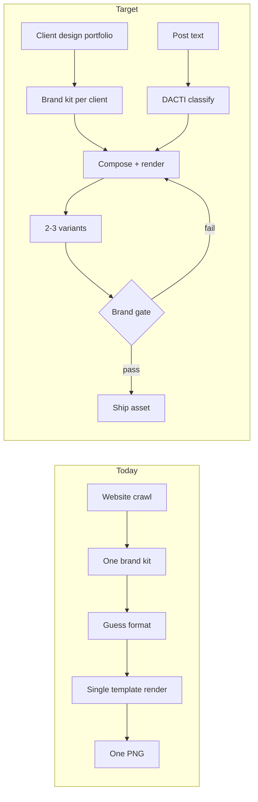

## What's broken today

A few things worth calling out because they're already hurting output, not just future nice-to-haves.

**Schema drift.** The runtime schema has around 20 visual formats. The induced DACTI schema has 14. Charts and the mafia ecosystem graphic were added manually on top. That's why a full re-run of induction matters, not just tweaking individual rules.

**Portfolio shape mismatch.** What stage 1 extraction writes for the design portfolio doesn't match what concept generation expects (philosophy, tone, prohibitions, etc.). When those fields are missing, generation falls back to generic defaults. This is actively making visuals feel templated right now and needs to be fixed in phase 0.

**Silent wrong layouts.** Several formats don't have real templates yet. The renderer falls back to a numbered list or headline card without surfacing an error. Comparison tables, timelines, ranked lists, checklists, process diagrams, event cards. So the system can report success while showing the wrong visual type.

**Export size.** Default output is 1200x630 (link preview). Most of our LinkedIn collateral is 1080 square or 1080 portrait. We need explicit canvas profiles, not one size for everything.

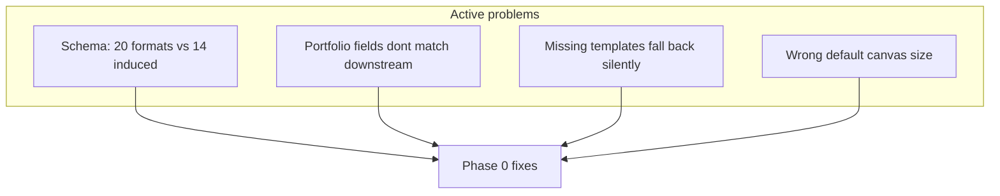

## Flow in the content engine

Post gets finalized. System loads that client's design portfolio (tokens, fonts, components, example posts we've already designed for them). Post gets classified on two axes: what kind of post it is (content type) and what visual format fits (modality). Those are separate decisions in DACTI and the engine should treat them that way.

Suggested format gets shown in the editor. Human can override before we render anything. Then we generate 2-3 fully rendered options, score each one, regenerate or flag anything that fails brand check. Human picks one or we auto-select the top score. Asset gets attached to the post with a version stamp so we can reproduce it later.

This stops being a CLI you run locally and becomes a job the content engine fires off per client, per post.

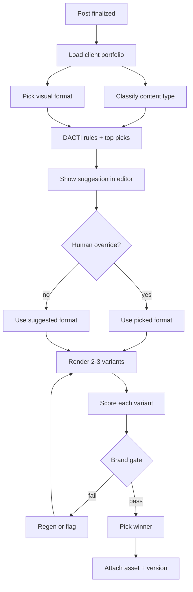

## Design portfolios

We already do the hard part on the Flywheel side. Client design systems have tokens, components, LinkedIn collateral, brand rules as visual guidelines. The pipeline should treat that as the source of truth instead of trying to reverse-engineer a brand from a homepage crawl.

Crawl data still helps. Logos, motifs, homepage screenshots for comparison. But designer-authored tokens and rules win when there's a conflict.

Flywheel's own formats (stat panels, mafia graphics, that cream/glass look) stay Flywheel-only. Client work should never inherit that by accident.

When a client has a stat square, a statement post, a testimonial layout in their collateral, those become the reference for how their automated visuals should feel. Not a generic template with their purple swapped in.

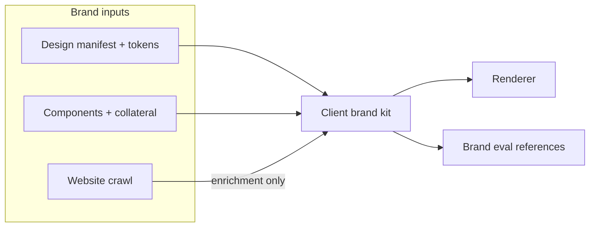

## Keeping clients from looking like each other

Main thing I'm worried about is two clients getting the same grid with different hex values.

Each client should have a style fingerprint: tokens, type pairing, motifs, how dense or airy they are, decorative patterns. Before we ship anything, run a similarity check against other clients' recent visuals. If the structure is basically identical, reject it and try again with that client's layout preferences.

Concept generation needs to stay inside the client's vocabulary. Their prohibitions, their component set, their collateral patterns. A/B variants should differ in format or composition, not just copy tweaks.

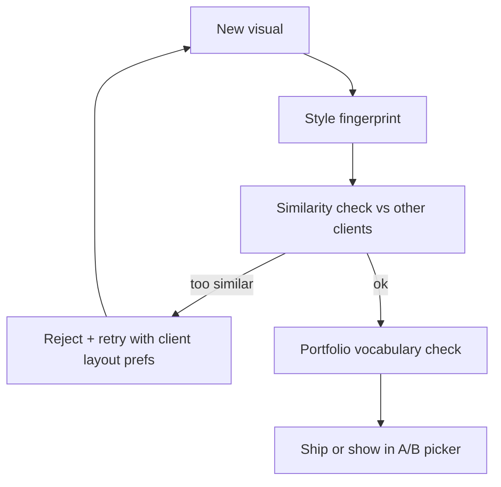

## Rendering without a new template every time

I don't want us building a bespoke template every time someone needs a new visual type.

Rough approach:

1. Primitives. Headlines, stats, quotes, lists, cards, accents, logos, charts. Maybe a dozen building blocks total.
2. Recipes. Each visual format is just how you arrange those blocks. Stat post = eyebrow + big number + supporting line + logo.
3. Layout engine. Recipe + client tokens + canvas size (1080 square, portrait, whatever) compiles into the final layout.

AI-generated custom layouts only when nothing in the recipe set fits. Keep existing templates around for the formats we know work while we migrate.

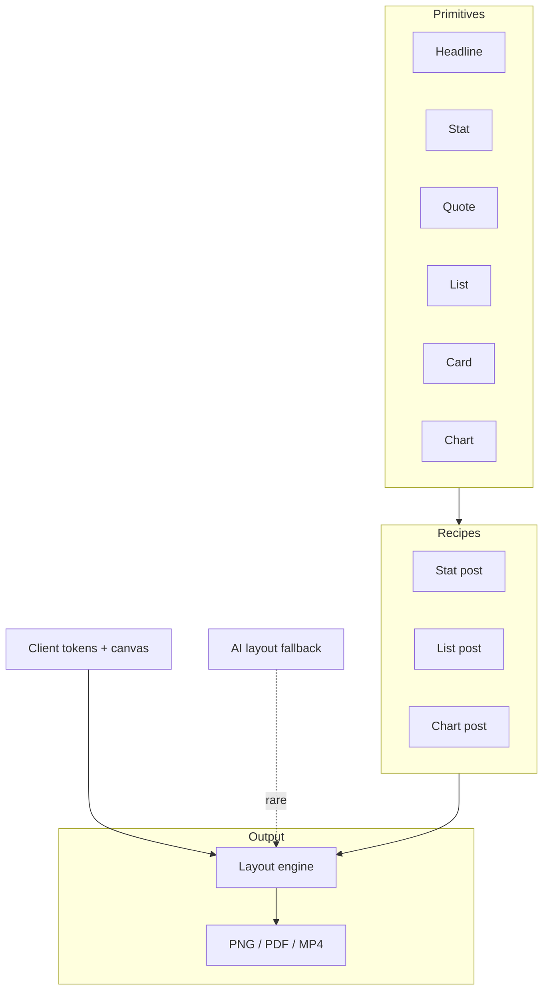

## Five things to prioritize

### Format selection (DACTI)

DACTI is dual-axis: content type (milestone, hot take, data insight, etc.) and visual format are classified separately, then matched via decision rules. Held-out accuracy is ~42% because rules are loose priors and the model often ignores them.

Merge the tiny format categories that barely have examples (process diagrams, timelines). Re-run induction on the full corpus including our own production posts so we're not maintaining two diverging format lists. Lock the model to re-rank within top picks instead of free choice. When engagement data breaks a tie, it has to be per content type, not global. Otherwise everything drifts toward stat panels because they win on median engagement overall. Log when humans override in the editor so we can fix rules over time.

Aim for 70%+ accuracy and under 15% override rate.

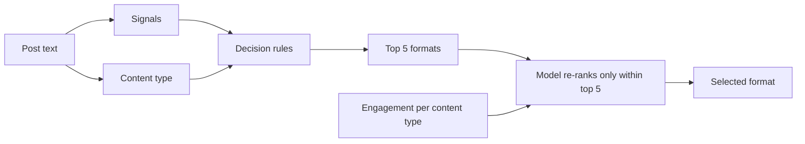

### Client design replication

Store homepage and collateral screenshots per client, not just palettes. Separate display type from body type. Track secondary accents and signature motifs. Don't export unless it passes on look, typography, color, and "does this feel generic." Auto-regen when it drifts. Tag failure modes (wrong font, wrong accent, missing motif) so we're not blindly retrying.

Aim for 80%+ passing brand gate on first render.

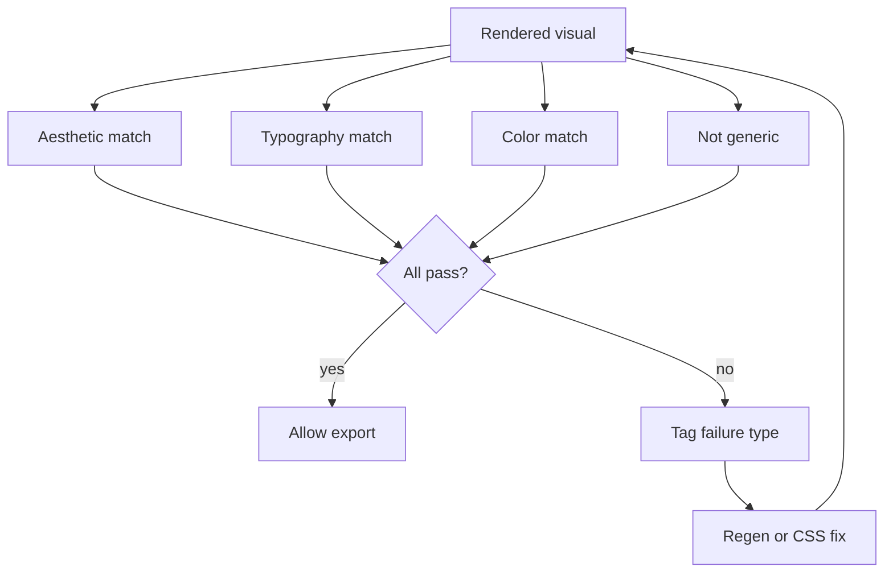

### A/B per post

Generate 2-3 actual renders, not 2-3 concepts with one image. Score all of them. Rank by brand gate, then quality, then engagement bias if needed. Side by side in the UI, pick or auto-select.

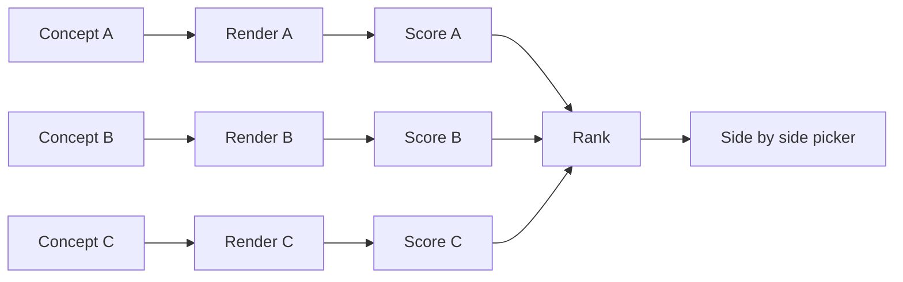

### Motion

Fade-in headlines, counting stats, staggered lists, light particle stuff where the brand already uses that. Record to MP4/GIF for LinkedIn video. Only bother with motion on visuals that already pass the static brand check.

### Charts

Validate chart data properly before render. Handle the annoying cases: one data point, too many categories, missing labels, negatives. Need a proper demo set and visual regression before we trust this in prod.

## Format roadmap

Ship first: headline cards, bold statements, stat callouts, stat panels, numbered lists, feature lists, pull quotes.

Next: bar charts, sparklines, donuts, comparison tables, ranked lists, checklists, event cards.

Consolidate overlapping stuff. Timelines and process diagrams can fold into lists. Attribution quotes into pull quotes. Get down to ~14 formats instead of 20.

Mafia ecosystem and Flywheel infographic stat panels stay internal only.

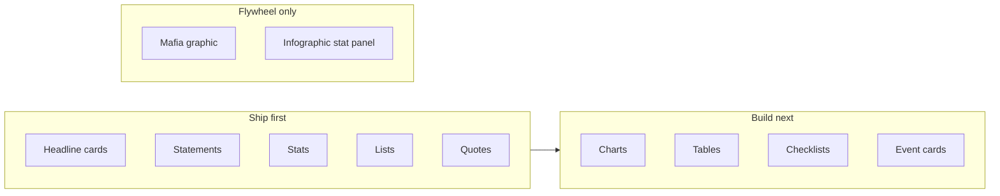

## Cleanup

**Cut:** duplicate templates, broken format mappings, Flywheel styling leaking into client renders, single global brand config, 1200x630 as the default export (fine as link preview, wrong for feed).

**Rebuild:** per-client brand registry, composition engine, better classifier with engagement tie-breaks, brand fidelity gate, multi-variant renderer, video export, cross-client similarity check.

**Adapt:** crawl stage merges with manifest instead of replacing it, rules actually bind top picks, concept gen reads portfolio properly, renderer uses client fonts and right canvas sizes, eval loop handles multiple variants and compares against collateral not just homepage.

## Phasing

**Phase 0 (~2 weeks):** Brand kit shape, load portfolios from our design system, fix gaps between extraction and generation, fix export sizes, fence off Flywheel-only formats.

**Phase 1 (~2-3 weeks):** Job hook for content engine, per-client versioning, classifier v2, brand gate, collateral reference library.

**Phase 2 (~3-4 weeks):** Primitives, recipes, migrate top formats off templates, chart validation, similarity detector.

**Phase 3 (~2-3 weeks):** Multi-render per post, picker UI, motion, video/GIF.

**Phase 4 (ongoing):** Per-client regression, learn from overrides, cost caps, tracing, designer workflow in the engine.

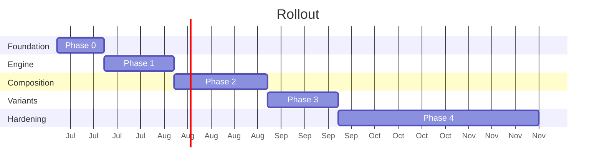

## How we'll know it's working

| Thing                         | Now           | Target                |
| ----------------------------- | ------------- | --------------------- |
| Format pick accuracy          | ~42%          | 70%+                  |
| Brand gate pass first try     | unknown       | 80%+                  |
| Human override on format      | n/a           | under 15%             |
| Cross-client similarity flags | not measuring | under 10% of pairs    |
| Variants needing regen        | ~1 retry      | under 30%             |
| "Looks generic" feedback      | n/a           | none in first 90 days |

